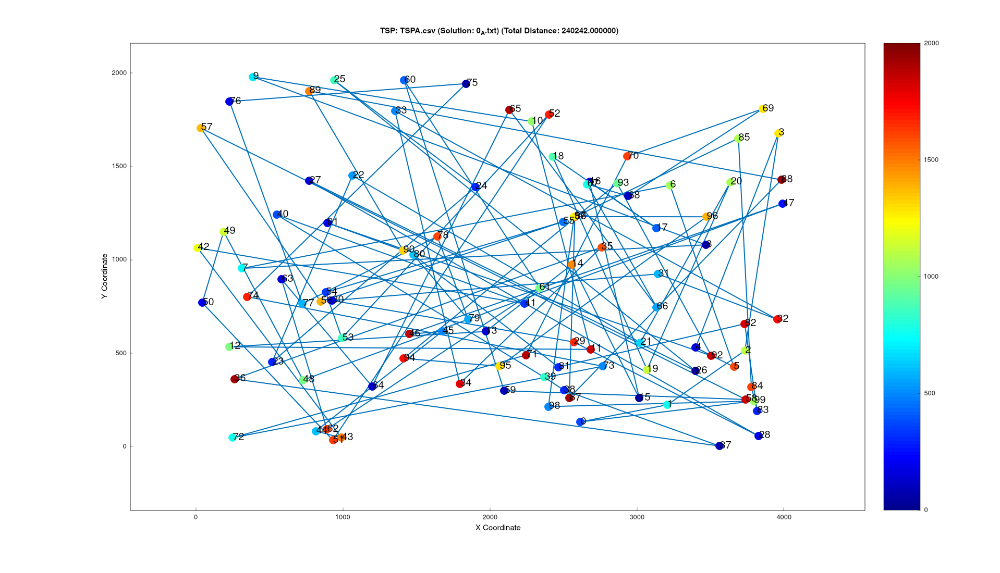
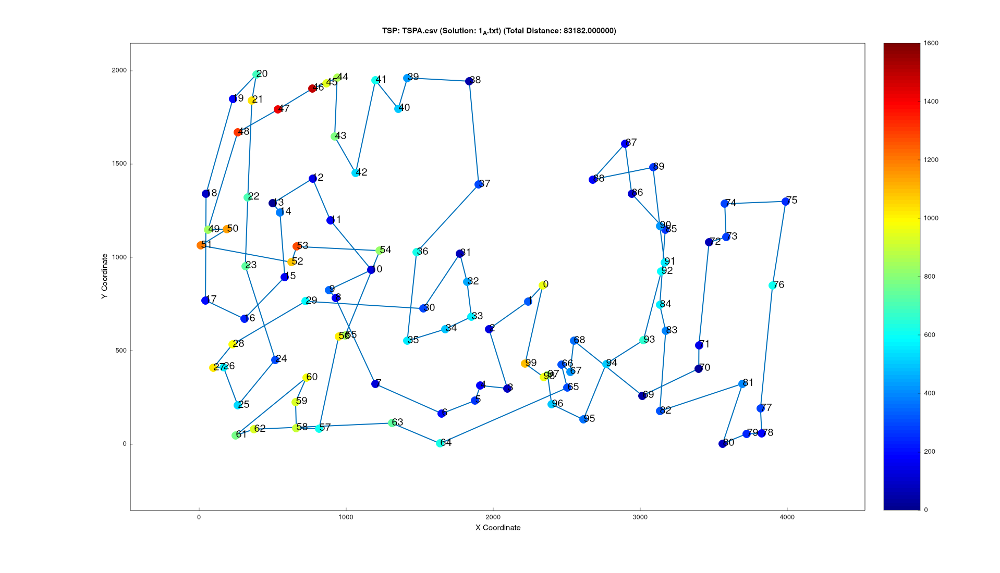
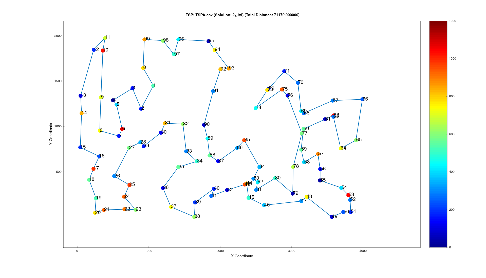
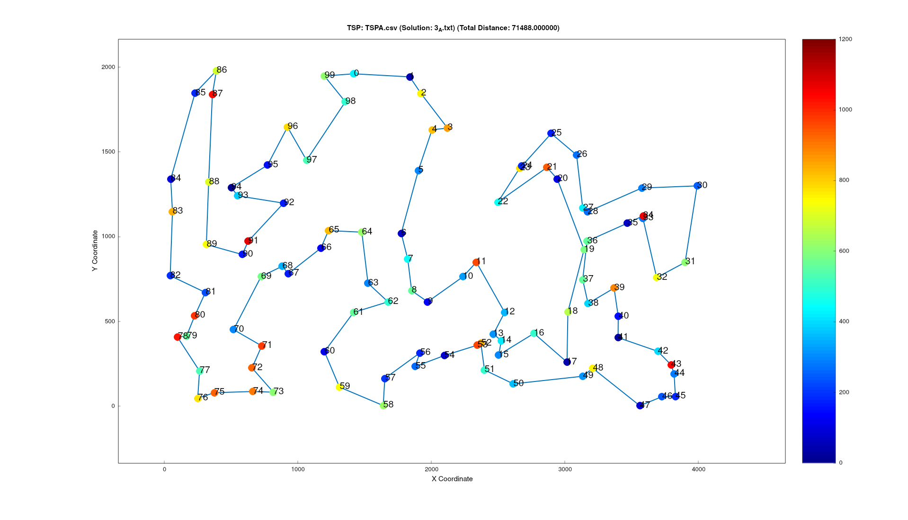
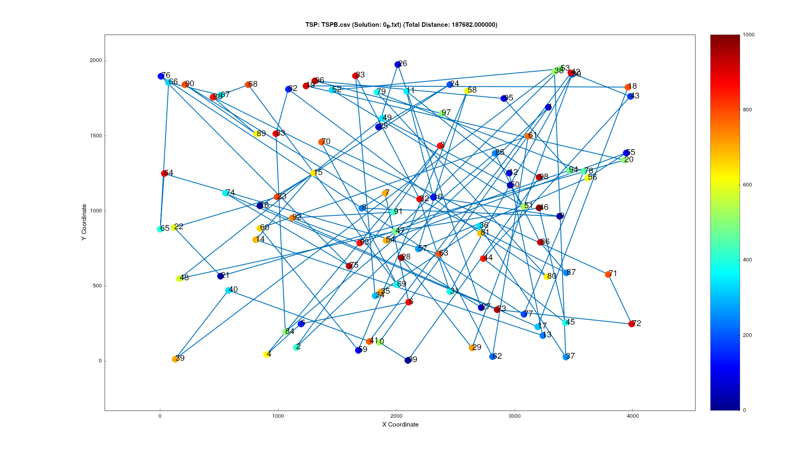
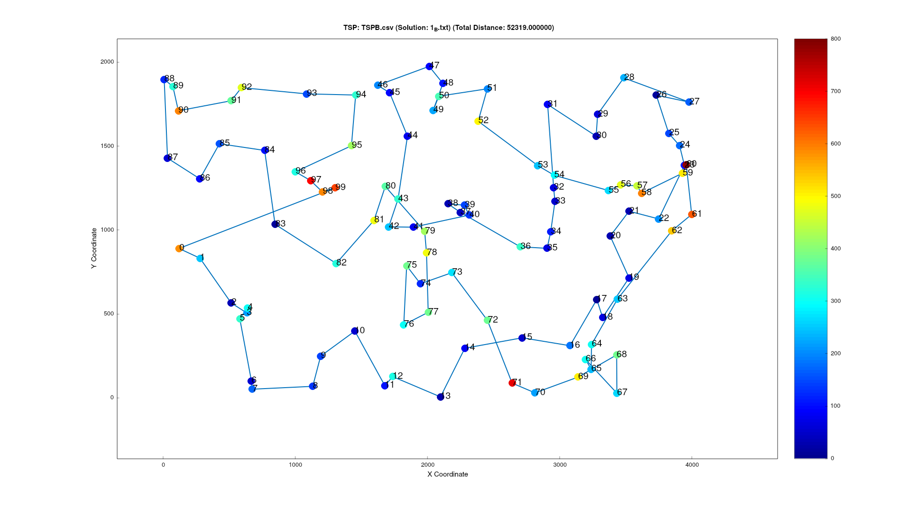
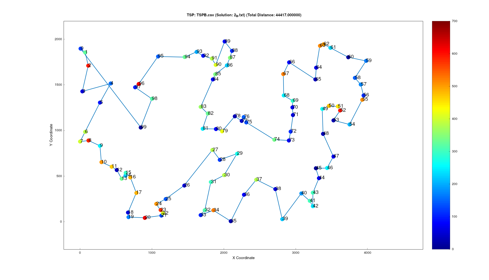
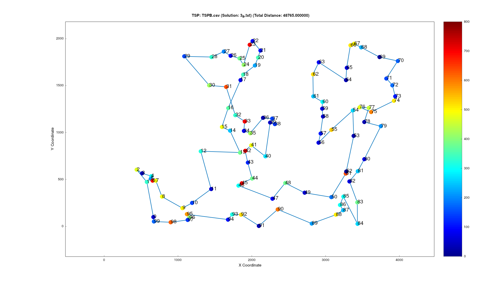

# Report 1
## Evolutionary Computing
## Authors: [addobosz](https://github.com/addobosz), [Wector1](https://github.com/Wector1)


### Description of the problem
In this report, we approach the TSP problem (minimal cost Hamiltonian cycle) with several methods based on greedy heuristics and compare their performace. Those include:
1.  Random solution
2.  Nearest neighbor considering adding the node only at the end of the current path
3.  Nearest neighbor considering adding the node at all possible position, i.e. at the end, at the beginning, or at any place inside the current path
4.  Greedy cycle

Detailed description:
```
We are given three columns of integers with a row for each node. The first two columns contain x and y coordinates of the node positions in a plane. The third column contains node costs. 

The goal is to select exactly 50% of the nodes (if the number of nodes is odd we round the number of nodes to be selected up) and form a Hamiltonian cycle (closed path) through this set of nodes such that the sum of the total length of the path plus the total cost of the selected nodes is minimized.
```

### Pseudocode of all implemented algorithms
1. Random solution: 
```
solution = []
repeat
    select randomly a vertex that is not already in the solution
    solution += vertex
until N vertices have been chosen
```
2. Nearest neighbor considering adding the node only at the end of the current path:
```
NearestNeighbour(distances, costs, start_point):
    path ← empty list
    visited ← array[0..n-1] initialized to FALSE
    point ← start_point

    FOR i FROM 0 TO n/2 - 1 DO
        visited[point] ← TRUE
        APPEND point TO path

        lowest_cost ← ∞
        lowest_cost_point ← -1

        FOR each city j FROM 0 TO n-1 DO
            IF NOT visited[j] THEN
                total_cost ← distances[point][j] + costs[j]
                IF total_cost < lowest_cost THEN
                    lowest_cost ← total_cost
                    lowest_cost_point ← j
                ENDIF
            ENDIF
        ENDFOR

        point ← lowest_cost_point
    ENDFOR

    RETURN path
END FUNCTION
```
3. Nearest neighbor considering adding the node at all possible positions, i.e. at the end, at the beginning, or at any place inside the current path:
```
FUNCTION NearestNeighbour2(distances, costs, start_point):
    n ← number of points
    visited[0..n-1] ← FALSE
    next_node[0..n-1] ← -1
    first ← last ← start_point
    visited[start_point] ← TRUE

    // Initialize priority queues for possible insertions
    q_before ← all candidates to add before the current path
    q_end ← all candidates to add after the current path
    q_middle ← map of (segment_start, segment_end) → priority queue of insertions in between

    FOR iteration FROM 1 TO n/2 - 1 DO
        // Get best available candidates
        (cost_b, point_b, source_b) ← best valid candidate from q_before
        (cost_e, point_e, source_e) ← best valid candidate from q_end
        (cost_m, point_m, source_m, dest_m) ← best valid candidate from q_middle

        // Choose cheapest of the three insertion options
        IF cost_b ≤ cost_e AND cost_b ≤ cost_m THEN
            INSERT point_b before path start
            first ← point_b
            UPDATE q_before and q_middle
        ELSE IF cost_e < cost_m THEN
            INSERT point_e after path end
            last ← point_e
            UPDATE q_end and q_middle
        ELSE
            INSERT point_m between source_m and dest_m
            UPDATE q_middle around that segment
        ENDIF

        visited[new_point] ← TRUE
    ENDFOR

    // Reconstruct path from linked structure next_node[]
    path ← [first]
    WHILE next_node[path.last] ≠ -1 DO
        APPEND next_node[path.last] TO path
    ENDWHILE

    RETURN path
END FUNCTION

```
4. Greedy cycle
```
FUNCTION NearestNeighbourCycle(distances, costs, start_point):
    n ← number of cities
    visited[0..n-1] ← FALSE
    next_node[0..n-1] ← -1
    first ← last ← start_point
    visited[start_point] ← TRUE

    // Priority queues for cheapest insertions
    q_before ← possible insertions before the path
    q_end ← possible insertions after the path
    q_middle ← map of (i, j) → priority queue of insertions between i and j

    INITIALIZE q_before, q_end with all unvisited cities' costs from start_point

    FOR step FROM 1 TO n/2 - 1 DO
        // Find best available insertion of each type
        (cost_b, city_b) ← best valid entry in q_before
        (cost_e, city_e) ← best valid entry in q_end
        (cost_m, city_m, src_m, dst_m) ← best valid entry across q_middle

        // Choose the globally cheapest insertion
        IF cost_b ≤ cost_e AND cost_b ≤ cost_m THEN
            INSERT city_b before current start
            first ← city_b
            UPDATE q_middle with new possible cycles between city_b and its neighbor

        ELSE IF cost_e < cost_m THEN
            INSERT city_e after current end
            last ← city_e
            UPDATE q_middle with new possible cycles between its neighbors

        ELSE
            INSERT city_m between src_m and dst_m
            UPDATE q_middle for new segments created by city_m
        ENDIF

        visited[new_city] ← TRUE
    ENDFOR

    // Reconstruct path from linked structure
    path ← [first]
    WHILE next_node[path.last] ≠ -1 DO
        APPEND next_node[path.last] TO path
    ENDWHILE

    RETURN path
END FUNCTION
```

### Results of a computational experiment: for each instance and method min, max and average value of the objective function.

TSP A:

1. **Random**:
min: 231698, average: 264153, max: 307454
    
    Elapsed(ms)=1
2. **Nearest neighbor, at the end only**:
min: 83182, average: 85108.5, max: 89433
    
    Elapsed(ms)=7
3. **Nearest neighbor, at all possible positions**:
min: 71179, average: 73172.9, max: 75450

    Elapsed(ms)=143
4. **Greedy cycle**:
min: 71488, average: 72737.6, max: 74924

    Elapsed(ms)=104

TSP B:

1. **Random**:
min: 188356, average: 212844, max: 239003

    Elapsed(ms)=0
2. **Nearest neighbor**, at the end only:
min: 52319, average: 54390.4, max: 59030

    Elapsed(ms)=2
3. **Nearest neighbor**, at all possible position:
min: 44417, average: 45870.3, max: 53438

    Elapsed(ms)=128
4. **Greedy cycle**:
min: 48765, average: 51365.4, max: 57294

    Elapsed(ms)=102


### 2D visualization of the best solution for each instance and method. Cost of nodes should be presented e.g. by a color, greyscale, or size.
#### TSP A:

1. 
2.  
3. 
4. 

#### TSP B:

1. 
2. 
3. 
4. 

### The best solutions for each instance and method presented as a list of nodes indices (starting from 0).
**TSP A:**

1. 75,25,157,71,145,38,138,181,185,108,114,87,48,63,111,120,62,178,15,82,39,129,46,184,137,93,78,139,175,74,65,55,98,0,173,128,147,16,101,26,41,94,103,29,112,133,45,90,35,195,34,156,64,149,116,148,105,20,13,53,143,124,126,42,123,83,57,9,49,58,155,99,10,2,192,183,18,43,66,79,51,97,17,113,85,95,33,150,107,36,109,115,168,102,161,136,8,37,86,56

2. 124,94,63,53,180,154,135,123,65,116,59,115,139,193,41,42,160,34,22,18,108,69,159,181,184,177,54,30,48,43,151,176,80,79,133,162,51,137,183,143,0,117,46,68,93,140,36,163,199,146,195,103,5,96,118,149,131,112,4,84,35,10,190,127,70,101,97,1,152,120,78,145,185,40,165,90,81,113,175,171,16,31,44,92,57,106,49,144,62,14,178,52,55,129,2,75,86,26,100,121

3. 68,46,115,139,193,41,5,42,181,159,69,108,18,22,146,34,160,48,54,177,10,190,4,112,84,35,184,43,116,65,59,118,51,151,133,162,123,127,70,135,180,154,53,100,26,86,75,44,25,16,171,175,113,56,31,78,145,179,92,57,52,185,119,40,196,81,90,165,106,178,14,144,62,9,148,102,49,55,129,120,2,101,1,97,152,124,94,63,79,80,176,137,23,186,89,183,143,0,117,93

4. 143,183,89,186,23,137,176,80,79,63,94,124,152,97,1,101,2,120,129,55,49,102,148,9,62,144,14,178,106,165,90,81,196,40,119,185,52,57,92,179,145,78,31,56,113,175,171,16,25,44,75,86,26,100,53,154,180,135,70,127,123,162,133,151,51,118,59,65,116,43,184,35,84,112,4,190,10,177,30,54,48,160,34,146,22,18,108,69,159,181,42,5,115,41,193,139,68,46,0,117

**TSP B:**

1. 91,140,78,69,162,5,58,49,138,86,35,15,18,127,19,74,121,89,23,192,66,117,16,116,155,168,70,153,68,146,28,81,12,65,21,87,143,137,4,108,193,79,101,60,119,114,110,144,42,195,62,128,6,149,56,94,22,111,184,36,112,174,187,41,92,27,107,133,115,82,85,48,93,186,131,171,40,163,99,132,180,159,147,67,45,34,64,194,44,191,17,160,158,157,130,152,150,189,181,141

2. 16,1,117,31,54,193,190,80,175,5,177,36,61,141,77,153,163,176,113,166,86,185,179,94,47,148,20,60,28,140,183,152,18,62,124,106,143,0,29,109,35,33,138,11,168,169,188,70,3,145,15,155,189,34,55,95,130,99,22,66,154,57,172,194,103,127,89,137,114,165,187,146,81,111,8,104,21,82,144,160,139,182,25,121,90,122,135,63,40,107,100,133,10,147,6,134,51,98,118,74

3. 40,107,100,63,122,135,38,27,16,1,156,198,117,193,31,54,73,136,190,80,162,175,78,142,45,5,177,104,8,111,82,21,61,36,91,141,77,81,153,187,163,89,127,103,113,176,194,166,86,95,130,99,22,185,179,66,94,47,148,60,20,28,149,4,140,183,152,170,34,55,18,62,124,106,143,35,109,0,29,160,33,138,11,139,168,195,145,15,3,70,13,132,169,188,6,147,191,90,51,121

4. 190,193,198,117,54,31,164,73,136,45,5,177,25,104,138,182,139,168,195,145,15,3,70,161,13,132,169,188,6,147,134,43,11,49,33,160,29,109,35,0,111,144,56,8,82,87,21,77,81,153,163,180,176,86,95,128,106,124,62,18,55,34,170,152,183,140,4,149,28,20,60,148,47,94,66,22,130,99,185,179,166,194,113,114,137,103,89,127,165,187,97,141,91,61,36,142,78,175,162,80


### Information whether the best solutions have been checked with the solution checker.
Yes, the best solutions indeed have been checked with the solution checker.

### The source code
https://github.com/Wector1/Evolutionary-Computing

### Conclusions
The computational results clearly show that more sophisticated nearest-neighbour variants yield significantly better solutions for the TSP compared to a purely random approach. Among all tested heuristics, the **nearest neighbour considering all possible insertion positions** achieved **the lowest minimum (min) objective value**, which is crucial since minimizing the minimum reflects the method’s ability to consistently find the best-quality routes. The **greedy cycle method** performed comparably in average and maximum values but was slightly less effective at minimizing the minimum cost. While the added complexity of these methods increases computational time, the improvement in solution quality—particularly the reduction of the minimum cost—demonstrates that considering flexible insertion strategies leads to more optimal TSP tours.